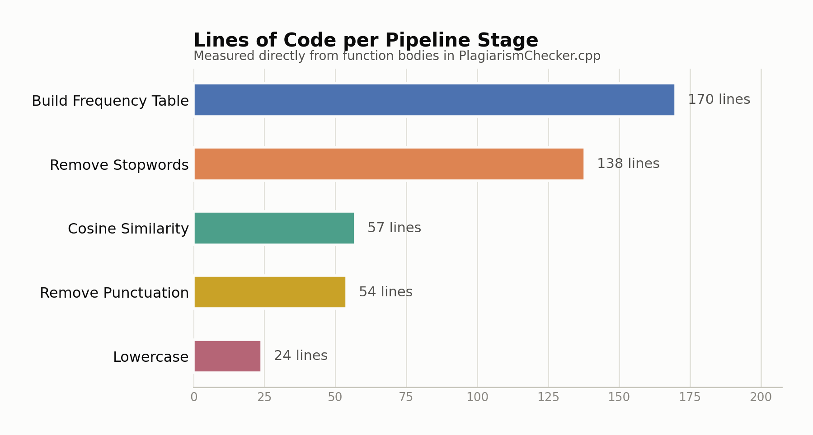
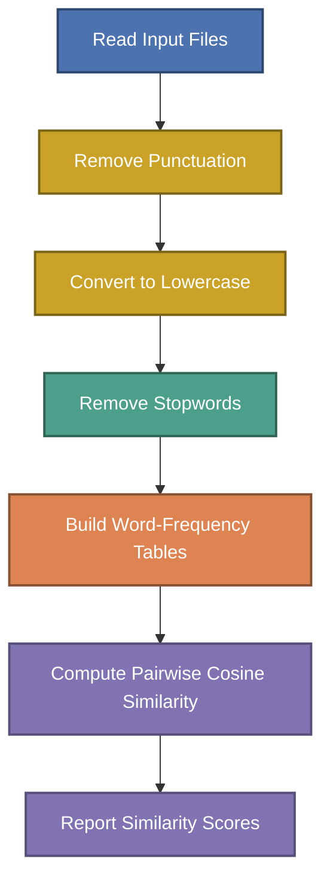

# Plagiarism Checker

A C++ console tool that detects likely plagiarism between text documents by cleaning their text and comparing word-frequency vectors with cosine similarity.


## Context

This project was built as a Data Structures course assignment. The header of `PlagiarismChecker.cpp` credits the author directly:

```
// Minahil Kashif
// 23i-0554
// CS-F
```

The assignment's constraint (and the point of the exercise) is doing everything with raw C-style arrays and pointers — `char*` / `char**` buffers, manual memory management, and hand-rolled string parsing — instead of `std::string` or STL containers. That constraint shapes almost every function in the file.

## Project at a Glance

<picture>
  <source media="(prefers-color-scheme: dark)" srcset="docs/charts/pipeline-stages-dark.png">
  
</picture>

*Line counts measured directly from the real function bodies in `PlagiarismChecker.cpp` — stopword removal and frequency-table construction are the heaviest stages, since both involve manual word-boundary scanning across every line of every document.*

## Processing Pipeline



## How It Works

The program is driven by a **master input file** (its path is passed to `readInput`). That file has three parts, read line by line:

1. **Line 1** — a label followed by a colon, then the stopword list, e.g. `StopWords: the a an is are of to and in on at`. Only the text after the `:` is parsed as space-separated stopwords.
2. **Line 2** — the number of documents to compare, as a plain integer (e.g. `3`).
3. **Remaining lines** — one file path per document, in order.

Each of those document files is read as ordinary plain text (`convertDocToCstring`) and stored line-by-line in a `Storage` object. From there, `Document` runs the whole pipeline over every document in place:

| Stage | Function(s) | What it actually does |
|---|---|---|
| Read input | `readInput`, `getNumberOfDocument`, `getText` | Parses the master file into stopwords + document count + document paths, then loads every listed document's raw text into memory. `getText` reconstructs a document's current content as one string at any point in the pipeline. |
| Remove punctuation | `removePunctuationMarks` → `Document::removePunctuations` | Rebuilds every line keeping only `A–Z`, `a–z`, and single spaces (collapsing runs of spaces/blank tokens); digits and punctuation are dropped entirely. |
| Lowercase | `convertUpperToLowerCase` → `Document::lowerCaseEmAll` | Walks every character in every line and shifts `A–Z` down to `a–z` in place. |
| Remove stopwords | `removeStopWords` → `Document::removeStopWords` | Re-splits each line into words on spaces and rebuilds the line, dropping any word whose length and characters exactly match an entry in the parsed stopword list. |
| Build frequency tables | `generateFrequencies` → `Document::extractUniqueWords` | Scans every cleaned line of every document to build one global list of unique words, then fills a `documentFrequency[doc][word]` count matrix — how many times each unique word appears in each document. |
| Look up a count | `getFrequency` | Given a word and a (1-based) document number, returns how many times that word occurs in that document, or `-1` if the word was never seen. |
| Compute similarity | `calculateAllCosineSimilarities`, `similarityIn` | Treats each document's row in the frequency matrix as a vector and computes cosine similarity for every document pair. |

## How Cosine Similarity Flags Plagiarism

For every pair of documents *i* and *j*, `calculateAllCosineSimilarities` treats their word-frequency rows as vectors over the shared vocabulary and computes:

```
similarity(i, j) = ( Σ freq_i[w] * freq_j[w] ) / ( |freq_i| * |freq_j| )
```

where `|freq_i|` is the Euclidean norm (magnitude) of document *i*'s frequency vector, `sqrt(Σ freq_i[w]²)`. The code rounds each magnitude to 2 decimal places, computes the ratio, rounds that to 2 decimals, then multiplies by 100 to express it as a percentage (0–100). Results are stored in a symmetric `numOfDocs × numOfDocs` matrix (`similarities[i][j] == similarities[j][i]`), and `similarityIn(doc1, doc2)` looks up a specific pair by 1-based document number.

Two documents that reuse the same words in similar proportions — even if reordered — end up pointing in nearly the same direction in this frequency-vector space, producing a similarity score close to 100. Documents with mostly disjoint, differently-distributed vocabulary score close to 0. A high score after stopwords have been stripped out is the signal used to flag likely plagiarism, since it means the overlap is in meaningful content words rather than common filler words.

## Build & Run

`PlagiarismChecker.cpp` implements the processing pipeline described above as a set of free functions and helper classes — it does **not** define a `main()` entry point in this file. To actually run it, pair it with a small driver that calls the declared functions in sequence, for example:

```cpp
#include ... // include PlagiarismChecker.cpp or link its translation unit

int main() {
    readInput("input.txt");          // parses stopwords, doc count, and doc paths
    removePunctuationMarks();
    convertUpperToLowerCase();
    removeStopWords();

    char** uniqueWords; int uniqueCount; int** docFrequency;
    generateFrequencies(uniqueWords, uniqueCount, docFrequency);

    double** similarities;
    calculateAllCosineSimilarities(similarities, docFrequency);

    int n = getNumberOfDocument();
    for (int i = 1; i <= n; i++)
        for (int j = i + 1; j <= n; j++)
            std::cout << "Doc " << i << " vs Doc " << j << ": "
                       << similarityIn(i, j) << "%\n";
}
```

Once you have a driver in place, compile with any standard C++ compiler:

```bash
g++ PlagiarismChecker.cpp -o PlagiarismChecker
./PlagiarismChecker
```

Prepare an `input.txt` master file pointing at your document files as described above, and place it (and the documents it references) where the program can find them by the paths given.

## Design Notes

- Fixed-size limits: `MAX_WORDS` and `MAX_LINE_LENGTH` (both 1000) bound the buffers used while parsing, in keeping with the assignment's low-level, array-based approach.
- All string handling — copying, length calculation, equality checks, word splitting — is implemented manually (`copyString`, `getStringLength`, `areStringsEqual`, `countWords`) rather than relying on `<string>` or `<cstring>`.
- The `Storage`, `InputOrganizer`, and `Document` classes each own their heap-allocated arrays and free them in their destructors.
